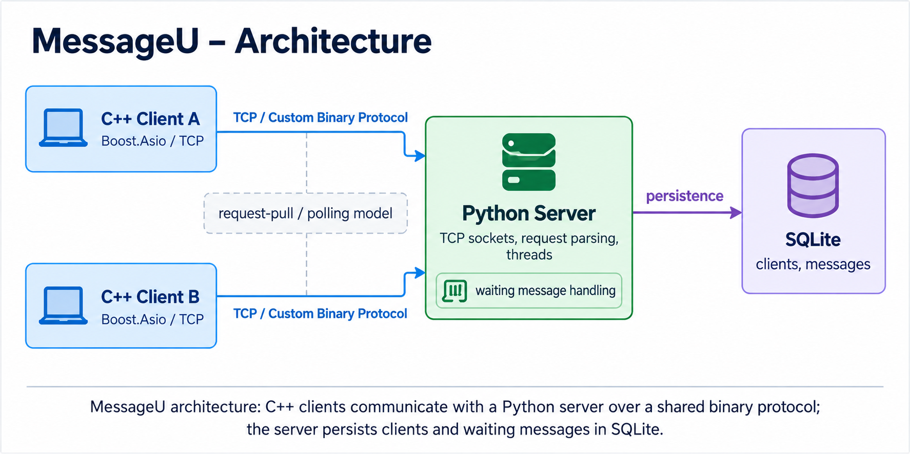
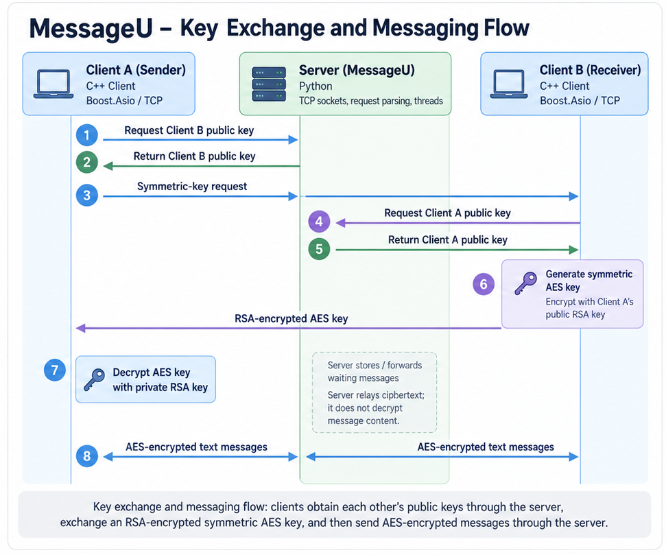

# MessageU

A C++/Python client-server messaging system using TCP, a custom binary protocol, RSA/AES-based encrypted messaging, and SQLite persistence.

## Overview

MessageU is a coursework project that implements a multi-client messaging system with a C++ client and a Python server.

The project focuses on lower-level client-server communication rather than HTTP/REST. Clients communicate with the server over raw TCP using a shared binary protocol, while the server handles user registration, public-key retrieval, message delivery, and persistence of waiting messages.

The project demonstrates:

- Cross-language communication between C++ and Python
- TCP socket programming
- Binary protocol serialization and parsing
- Multi-client server handling with threads
- Client-side polling and synchronization
- RSA/AES-based key exchange and encrypted messaging
- SQLite persistence

## Architecture

<p align="center">
  
</p>

The system consists of:

- **C++ clients** using Boost.Asio for TCP communication
- A **Python server** responsible for request parsing and message routing
- **SQLite** storage for registered clients and waiting messages

Clients periodically poll the server for waiting messages, allowing messages to remain available even when the receiving client was not actively requesting data when they were sent.

## Key Features

- Client registration with a unique 128-bit client ID
- Retrieval of registered clients
- Public-key lookup between clients
- Symmetric-key exchange using RSA
- AES-encrypted text messaging
- Storage and retrieval of waiting messages
- Multi-client server support using threads
- Persistent client and message storage using SQLite
- Background polling for incoming messages
- Thread synchronization around shared client resources and the TCP connection

## Custom Binary Protocol

MessageU uses a binary protocol shared by the C++ client and Python server.

A client request begins with the following header:

| Field | Size |
|---|---:|
| Client ID | 16 bytes |
| Version | 1 byte |
| Request Code | 2 bytes |
| Payload Size | 4 bytes |
| Payload | Variable |

The payload format depends on the request type.

Supported operations include:

- Registration
- Client-list retrieval
- Public-key retrieval
- Message delivery
- Retrieval of waiting messages

Numeric fields are serialized using little-endian byte ordering.

The C++ client serializes requests into the required wire format, while the Python server parses the same binary structure and generates corresponding binary responses.

## Encryption and Key Exchange

<p align="center">
  
</p>

MessageU uses asymmetric encryption to exchange a symmetric key between clients.

A simplified flow is:

1. Client A requests Client B's public RSA key from the server.
2. Client A sends Client B a request for a symmetric key.
3. Client B retrieves Client A's public RSA key.
4. Client B generates an AES key.
5. The AES key is encrypted using Client A's public RSA key and sent through the server.
6. Client A decrypts the AES key using its private RSA key.
7. The clients can then exchange AES-encrypted text messages through the server.

The server stores and forwards encrypted message content but does not need to decrypt the message payload.

## Concurrency and Message Handling

The Python server supports multiple clients concurrently using threads.

On the client side, a background polling thread periodically checks the server for waiting messages while the main thread remains available for interactive user commands.

Synchronization is used around shared resources, including the TCP connection and locally stored client information, to prevent concurrent access from the interactive and polling flows.

## Persistence

The server uses SQLite to persist:

- Registered clients
- Public keys
- Last-seen information
- Waiting messages

Messages remain stored until they are retrieved by the intended recipient.

The SQLite persistence layer was implemented as the optional persistence extension of the coursework specification.

## Technology Stack

### Client

- C++
- Boost.Asio
- TCP
- Threads / mutexes
- Crypto++
- RSA
- AES

### Server

- Python 3
- TCP sockets
- Threads
- `struct` for binary parsing
- SQLite

## Project Structure

```text
MessageU/
├── src/
│   ├── Client/
│   │   ├── ClientActions.*
│   │   ├── ClientConnection.*
│   │   ├── ClientContext.*
│   │   ├── ClientMenu.*
│   │   ├── FileManager.*
│   │   ├── Message.*
│   │   ├── PullRequests.*
│   │   ├── ResponseClient.*
│   │   ├── Utilities.*
│   │   ├── AESWrapper.*
│   │   ├── RSAWrapper.*
│   │   ├── Base64Wrapper.*
│   │   └── Main.cpp
│   │
│   └── Server/
│       ├── main.py
│       ├── connection.py
│       ├── request_handler.py
│       ├── database.py
│       └── get_port.py
│
├── docs/
│   └── images/
│       ├── architecture.png
│       └── encryption-flow.png
│
├── .gitignore
└── README.md
```

## Build and Run Requirements

The repository contains the project source code but does not bundle external C++ dependencies or generated build files.

### Requirements

- Windows
- Visual Studio 2022 or a compatible C++ toolchain
- C++11 or newer
- Boost / Boost.Asio
- Crypto++
- Python 3

The original project was developed for a Windows / Visual Studio environment.

### Server

The Python server uses standard Python modules, including SQLite support from the Python standard library.

Run the server from the project environment with:

```bash
python src/Server/main.py
```

The server reads its local port configuration from `myport.info.txt`. If the file is unavailable or invalid, the implementation falls back to its default port.

### Client

The C++ client must be built with Boost and Crypto++ available to the compiler and linker.

External dependency installations are intentionally not included in this repository.

Local runtime configuration and generated data files are excluded from version control through `.gitignore`.

These include files such as:

- `my.info.txt`
- `server.info.txt`
- `myport.info.txt`
- `defensive.db`

`my.info.txt` contains client-specific local data, including the client's private key, and must not be committed to source control.

## Security Limitations

MessageU was implemented according to an academic protocol specification and is **not intended to be a production-secure messaging application**.

Notable limitations include:

- AES-CBC with a fixed zero IV
- No authenticated-encryption mechanism
- 1024-bit RSA keys
- No TLS transport layer
- Public keys are distributed through the server without a separate PKI or identity-verification mechanism
- The client's private RSA key is stored locally
- A client ID alone is not cryptographic proof of identity

These limitations are important when evaluating the system from a security perspective.

The purpose of the project was to implement the specified encrypted messaging protocol while understanding the distinction between using cryptographic primitives and designing a production-grade secure protocol.

## Coursework Context and Attribution

MessageU was developed as part of the **Defensive Systems Programming** course at the Open University of Israel.

The coursework provided the overall system requirements and binary protocol specification, including request/response layouts and the required cryptographic flow.

The course also provided utility wrapper classes around Crypto++ for:

- AES encryption/decryption
- RSA public-key operations
- RSA private-key operations
- Base64 encoding/decoding

These wrappers are included in the client source as part of the original coursework environment.

The implementation work in this repository includes the client/server application logic, communication between the C++ and Python components, binary serialization and parsing, request handling, concurrent client handling, polling, persistence integration, and implementation of the specified messaging and key-exchange flow.

---

This repository is maintained as part of my software engineering portfolio.
